# Compiler Model

Once you understand datatables and contracts, the deeper model is useful:
Talika compiles a human-authored table into validated Python output.

```mermaid
flowchart LR
  A["raw list[list[str]]"] --> B["TableData"]
  B --> C["transform table"]
  C --> D["validate shape and labels"]
  D --> E["select variant"]
  E --> F["parse fields"]
  F --> G["build records"]
  G --> H["resolve references"]
  H --> I["validate records"]
  I --> J["validate table"]
  J --> K["build output"]
```

## Why this matters

Calling Talika a parser undersells it. A parser converts a string. Talika owns
the table lifecycle: shape, labels, fields, source metadata, references,
validation, and output.

## Extension points

You can override only the stage you need:

- `transform_table()` for custom table shapes
- `field(parser=...)` for cell syntax
- `validate_record()` for one record
- `validate_records()` for the whole table
- `build_output()` for custom result objects

Everything else keeps running around that extension.
